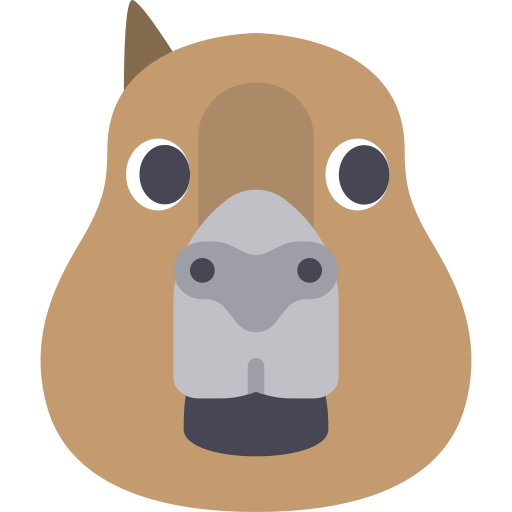

#  Capivara Chat

Este é um chat feito em Node.js com websockets, ainda em desenvolvimento.



## Instalação

É necessário ter o Node e o npm instalados.
Com isso basta clonar o repositório, instalar as dependências e iniciar a aplicação:

```bash
git clone https://github.com/GuilhermeBalog/capivara-chat.git
cd capivara-chat
npm install
npm start
```

> Para parar a aplicação no seu terminal digite `ctrl+c`

## Ideia / Roadmap

- O objetivo é usar websockets, com o módulo socket.io
- Ao entrar o user coloca seu nome e entra na sala
  - Talvez ter um chat privado
- Deploy no heroku
- Mobile em React Native?
- Identidade Visual Bonitinha
